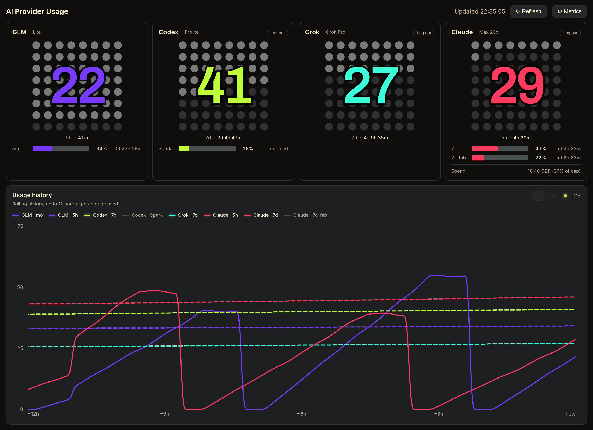

# AI Provider Usage Dashboard

One page that answers a single question: **how much of each AI plan have I actually burned, and when does it reset?**

Claude, Codex, Grok and GLM each meter you differently — 5-hour windows, 7-day windows, monthly tool-call caps — and each hides the number behind a different CLI or console. This polls all of them, puts them side by side, and keeps seven days of history so you can see the burn rather than guess at it.



<sub>Rendered from demo data via `node tools/screenshot.mjs` — not a real account.</sub>

Plain HTML, CSS and JavaScript on a Node standard-library server. No build step, no framework, no dependencies.

## What it shows

**Per provider, one card.** A dot gauge for the window you care about most, mini bars for the rest, and a live countdown to each reset. The gauge's big number is the percentage used; the lit dots are how far through the window's *duration* you are — so you can tell "80% used with 20 minutes left" from "80% used with four hours to go" at a glance.

**A history chart you can scroll back through.** It shows the last 12 hours and follows live. Drag it, scroll it sideways, or use the ‹ › buttons or arrow keys to page back through the seven days the server keeps; Home and End jump to the oldest sample and back to now. A browsed view holds still while new samples arrive, labels its axis with clock times, and swaps the *live* mark for *browsing* until you press **Now** or drag back to the present. Every window from every provider is a toggleable series. Click a legend entry to add or drop a line; the choice is remembered locally.

**On a phone, the same page folds down.** Each card shows one bar row for its primary window, with a tick on the track marking how far through the window you are; the other windows sit under a *N more* toggle. The page scrolls, a sideways swipe on the chart pans it, and plan names and Log out move to the ⚙ panel.

**Reset countdowns that mean something.** A window that has never been used doesn't start counting down — see *auto-arm* below.

## Providers

| Provider | Auth | Windows tracked |
| --- | --- | --- |
| **Claude** | OAuth (in-dashboard) | 5-hour, 7-day, 7-day Fable, spend against cap |
| **Codex** | OAuth (in-dashboard) | 7-day, plus per-model caps such as Codex-Spark |
| **Grok** | OAuth (in-dashboard) | Weekly |
| **GLM** | `ZAI_API_KEY` | 5-hour, monthly tool calls |

All OAuth logins are owned by this dashboard and stored in **its own** credential file. Other CLIs' credential files are never read or written. Each connected card has a **Log out** button that clears only what the dashboard stored.

## Quick start

Requires Node 20+ and nothing else.

```bash
git clone git@github.com:jbsx/usage_dashboard.git
cd usage_dashboard
cp .env.example .env     # add ZAI_API_KEY if you use GLM
npm start
```

Open <http://localhost:4321>. Connect Claude, Codex and Grok from their cards — each runs an OAuth flow once and stores the result. GLM needs only its API key in `.env`.

> **Note:** the server binds `0.0.0.0`, so it is reachable from your network, and it holds live OAuth credentials. Keep it on a trusted network or put it behind something.

## Configuration

Everything is optional except the GLM key. See [`.env.example`](.env.example).

| Variable | Default | Purpose |
| --- | --- | --- |
| `PORT` | `4321` | Port to listen on |
| `ZAI_API_KEY` | — | GLM coding-plan key ([get one](https://z.ai/manage-apikey/apikey-list)) |
| `ZAI_PING_MODEL` | `glm-4.5-air` | Model used for the GLM auto-arm ping |
| `CLAUDE_PING_MODEL` | `claude-haiku-4-5` | Model used for the Claude auto-arm ping |
| `CLAUDE_ENABLED` | `true` | Set `false` to hide the Claude card |
| `GROK_ENABLED` | `true` | Set `false` to hide the Grok card |
| `AUTH_STORE_PATH` | `~/.local/share/usage-dashboard/auth.json` | Dashboard-owned credentials |
| `SETTINGS_PATH` | `~/.local/share/usage-dashboard/settings.json` | Auto-arm preferences |
| `HISTORY_PATH` | `~/.local/share/usage-dashboard/history.json` | Seven days of samples |

## How it works

**Auto-arm.** A 5-hour window that has never been touched reports 0% used and no reset time — there's nothing to count down to, so the card can't tell you when you're getting capacity back. When enabled, the dashboard sends one deliberately tiny inference to arm the window and start its timer. The pings are the cheapest model on each plan (7 tokens for GLM, 21 for Codex), rate-limited by a cooldown, capped at a few consecutive ineffective attempts, and the card says so if it gives up.

Codex needs special handling here: while unarmed its API reports a *floating* `reset_at` of now + 5h on every poll, which looks like a live timer. A real window's reset is anchored and identical between polls, so the dashboard detects the forward drift instead of trusting the value.

**Serving stale rather than nothing.** Claude rate-limits aggressively and Grok's credits endpoint intermittently 500s. Rather than blanking a card, the last good reading is served with a `stale — <error>` note. Retries back off exponentially and honour any `retry-after` hint, because retrying every 60 seconds is precisely what keeps an account-level limiter tripped.

**Daily window verification.** Window identities are derived from their duration, so a plan change reclassifies them — but the stale-serving cache could otherwise keep an old window set alive indefinitely. Once a day a side-effect-free fetch re-checks every provider and invalidates snapshots whose window set actually changed.

**History and the chart.** The server samples every provider every 60 seconds and writes the result to `HISTORY_PATH`, pruned to seven days. The page's 60-second poll carries only the last 13 hours of it; scrolling further back fetches just the range in view from `/api/history?from=&to=` and keeps it in memory for the tab. Sampling is server-side, so history keeps filling while no browser has the page open; an open tab goes through the same cache and adds no extra provider traffic. Because the server only samples while it is running, history has holes: a few missed refreshes still draw as one line, but a longer silence is drawn as a **break** rather than a stroke implying usage that was never observed. Curve tangents are scaled per segment, so unevenly spaced samples can't make the line loop backwards in time across a gap.

## Tests

```bash
npm test        # node --test, no dependencies
```

Covers the usage parsers, the auto-arm state machine and its guardrails, the stale-serving cache and its backoff, the credential store, window verification, and the chart's rendering and gap handling.

## Layout

```
server.js          HTTP server, provider polling, OAuth flows
app.js             the whole front end: cards, gauges, chart
index.html         page shell
style.css          styling
lib/               one module per concern, each with tests
  autoarm.js         arming 5-hour windows, with guardrails
  usage-cache.js     stale-serving cache + exponential backoff
  usage-history.js   the seven-day sample store and its range queries
  usage-sampler.js   background tick that fills history with nobody watching
  window-verify.js   daily re-classification pass
  dash-auth.js       dashboard-owned credential + settings store
  claude.js codex-usage.js grok.js   provider parsers
  codex-ping.js glm-ping.js          the arming pings
test/              a test file per lib module, plus the front end
tools/             screenshot generation for this README
```

## Regenerating the screenshot

```bash
node tools/screenshot.mjs
```

Serves the real `index.html`/`app.js`/`style.css` against a generated demo payload, seeds the chart presets, and captures the page with headless Chrome. It never touches your live dashboard, credentials or stored history.
